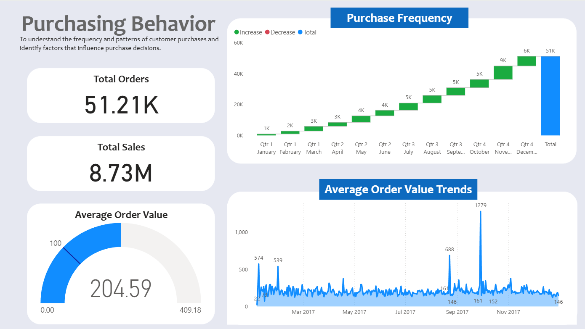
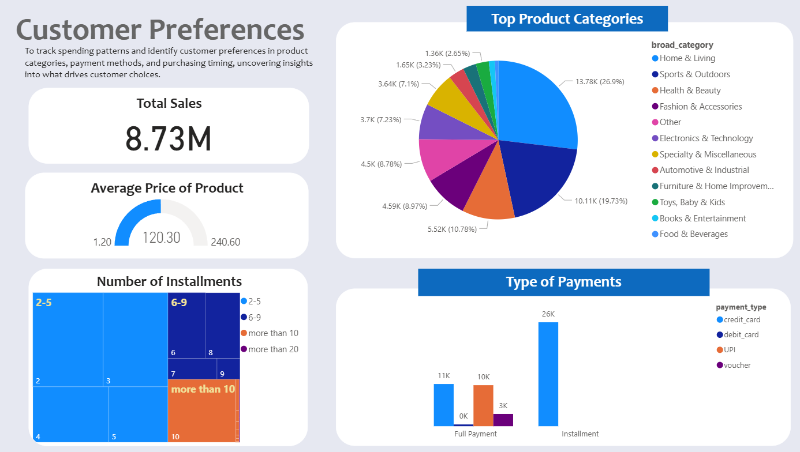
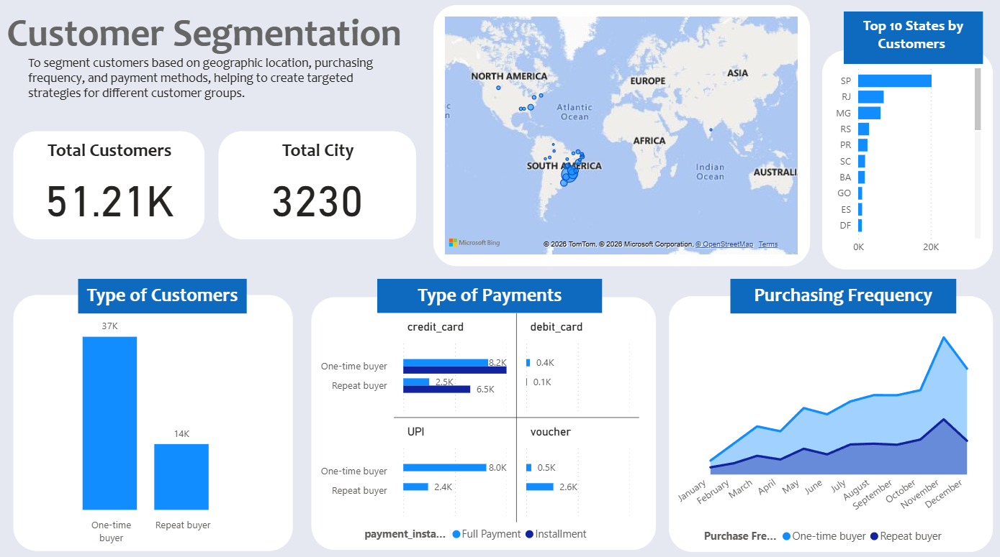

# 🛒 Customer Purchase Behavior Analysis with Hadoop

## 📌 Overview

In today’s fast-paced retail world, **data alone isn’t enough** — insights drive decisions. This project **transforms over 100,000 raw e-commerce records** from Target’s Brazilian operations into a **strategic roadmap for growth**, turning complex data into actionable business intelligence. Leveraging **Cloud Computing and Big Data frameworks**, it **decodes consumer behavior, uncovers patterns, and provides clear recommendations** to optimize operations and boost revenue.  

### Project Objectives
The project focuses on three key objectives:

1. **Analyze Customer Purchasing Behavior**  
   Understand how often customers buy, what drives their decisions, and uncover patterns in their shopping habits.

2. **Identify Customer Preferences**  
   Track spending trends across product categories, payment methods, and timing to reveal what influences purchasing decisions.

3. **Segment Customers Based on Behavior and Demographics**  
   Group customers by geography, purchase frequency, and payment preferences to enable **targeted strategies** for different segments.

**Dataset:** [Brazilian E-Commerce Dataset on Kaggle](https://www.kaggle.com/datasets/olistbr/brazilian-ecommerce)

---

## 🛠 Hadoop Ecosystem
To handle the **volume and variety of e-commerce data**, the project utilized a robust **Hadoop ecosystem** for scalable and precise data management:

  

The experiment runs in a **simulated Hadoop environment**, where raw datasets are ingested, organized, and standardized for consistent processing. Data is then **cleaned, transformed, and prepared** for analysis, and finally **visualized in interactive dashboards** that reveal customer behavior, market trends, and key business insights. This end-to-end workflow demonstrates a **scalable and integrated approach**, turning raw e-commerce data into actionable insights that support informed business decisions.

---

## 🔑 Key Findings

### 1. Customer Purchase Behavior

  

- **Total Orders & Revenue:** 51,211 orders generating **$8.73M**, with an **Average Order Value (AOV) of $204.59**.  
- **Seasonal Trends:** Highest purchase activity occurs in **November and December**, driven by holidays like Black Friday and Cyber Monday.  
- **Insight:** Timing of promotions and high-value product launches significantly impacts sales.  
- **Recommendation:** Focus on **seasonal promotions**, optimize inventory for peak months, and engage customers post-holiday through **loyalty programs and special offers**.

### 2. Customer Preferences

  

- **Top Categories:** **Home & Living (26.9%)**, **Sports & Outdoors (19.7%)**, **Health & Beauty (10.7%)**.  
- **Price Range Preference:** Average product price **$120.30**, indicating a preference for **mid-range items**.  
- **Payment Behavior:** Installment payments, especially via **credit cards**, are popular.  
- **Recommendation:** Prioritize high-performing categories, expand **installment options**, and create targeted promotions for lower-performing categories.

### 3. Customer Segmentation

  

- **One-Time vs. Repeat Buyers:** Majority (**37,000**) are **one-time buyers**, presenting an opportunity to increase retention.  
- **Payment Trends:** Credit cards dominate, while repeat buyers prefer **vouchers**, indicating loyalty program effectiveness.  
- **Regional & Seasonal Patterns:** High concentration of customers in specific regions; repeat buyers maintain consistent purchasing behavior throughout the year.  
- **Recommendation:** Convert one-time buyers with **personalized marketing, loyalty incentives, and referral programs**; optimize payment processes and run **region-specific campaigns** to improve engagement.

---

## ✅ Conclusion
This case study demonstrates the **successful integration of Hadoop-based processing with BI visualization**. By moving beyond traditional data silos, it provides a **clear, actionable blueprint** for Target to enhance market positioning and maximize **customer lifetime value** in the Brazilian e-commerce sector.
